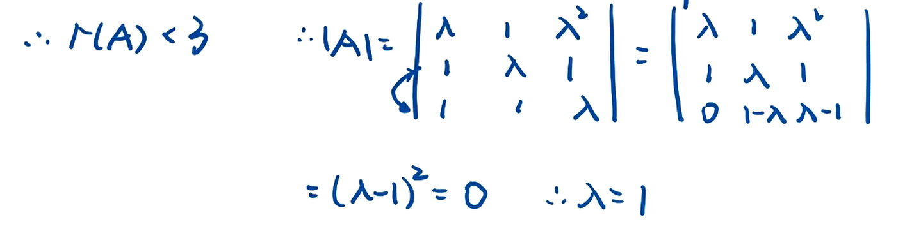

1. # 线性方程组

逻辑性, 充要条件考察

1. 解的判定
2. 线性方程组的计算
3. 线性方程组的结构, 性质

## 齐次线性方程组的基础解系

1. 初等行变换变成行最简(同解方程组)
   1. 行变换不改变;想一想（1）交换两行，相当于将方du程组中zhi两个方程交换位置。（2）一行乘一个数加到另一行相当一个方程乘一个数加上另一个方程 （3）一行乘一个非零数相当一个方程两边同乘一个非零数。这些变换都是可逆的。因此，方程组同解。

### 求解齐次线性方程

   

### 求解非齐次方程组

    

化成行最简之后, 取自由项为1, 其他的"反号顺抄", 对于特解, 自由项取0, 常数项"正号顺抄"

### 线性方程解的判定

对于矩阵的乘法, 相当于s个非齐次方程 

注意向量组线性标出的含义就是r(A) = r(A, b) = n, 我们说b可以由A唯一线性表出,  

### 含参数线性方程组的求解

如果系数矩阵是方阵可以求出对应的行列式

  

 

这一题用到了矩阵的秩的性质 r(A) + r(B) <= r(AB) + n, 其中A为m *n矩阵, B为n* s矩阵 

 

含参方程组中初等行变换的应用 

## 基础解系

1. AX=0的任两个基础解系等价
