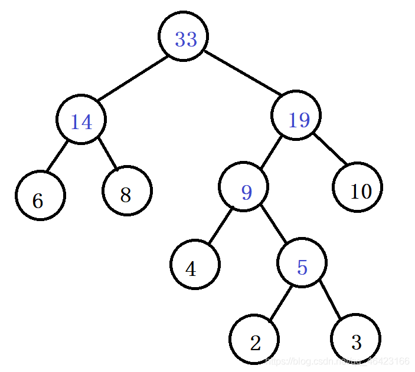
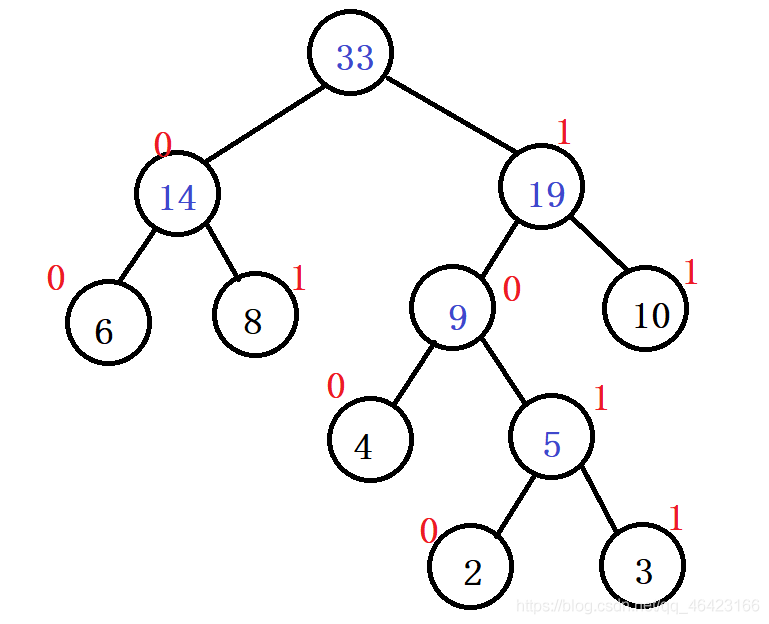
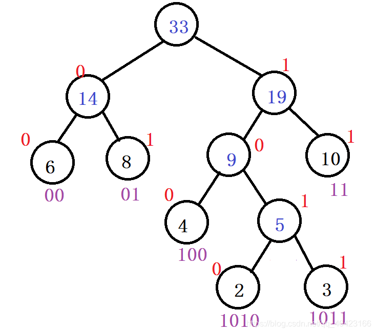

# [哈夫曼编码(Huffman)](https://blog.csdn.net/qq_46423166/article/details/106863818)

只要会构造哈夫曼树，哈夫曼编码特别简单，一眼就能看出来。方法如下：

**首先看下面题目**

> 已知字符集\{ a, b, c, d, e, f \}，若各字符出现的次数分别为\{ 6, 3, 8, 2, 10, 4 \}，则对应字符集中各字符的哈夫曼编码可能是：
>
> A，00, 1011, 01, 1010, 11, 100
>
> B，00, 100, 110, 000, 0010, 01
>
> C，10, 1011, 11, 0011, 00, 010
>
> D，0011, 10, 11, 0010, 01, 000
>
> 答案：A

### 解题步骤

一，先将这串数字构造为哈夫曼树

其实题目中，前半部分的字母已经不用看了，因为构造哈夫曼树正常是比大小，而这里比较出现次数大小。

排序为2，3，4，6，8，10

哈夫曼树为

二，将每个结点左右子树设为0，1，如下

三，将从头结点到此结点数合起来即为哈夫曼编码

此时可以得到题目中几个次数的字符集，即为对应字符的哈夫曼编码

- 2->1010
- 3->1011
- 4->100
- 6->00
- 8->01
- 10->11

所以各字符出现的次数分别为\{ 6, 3, 8, 2, 10, 4 \}，则对应字符集中各字符的哈夫曼编码可能是：00, 1011, 01, 1010, 11, 100
